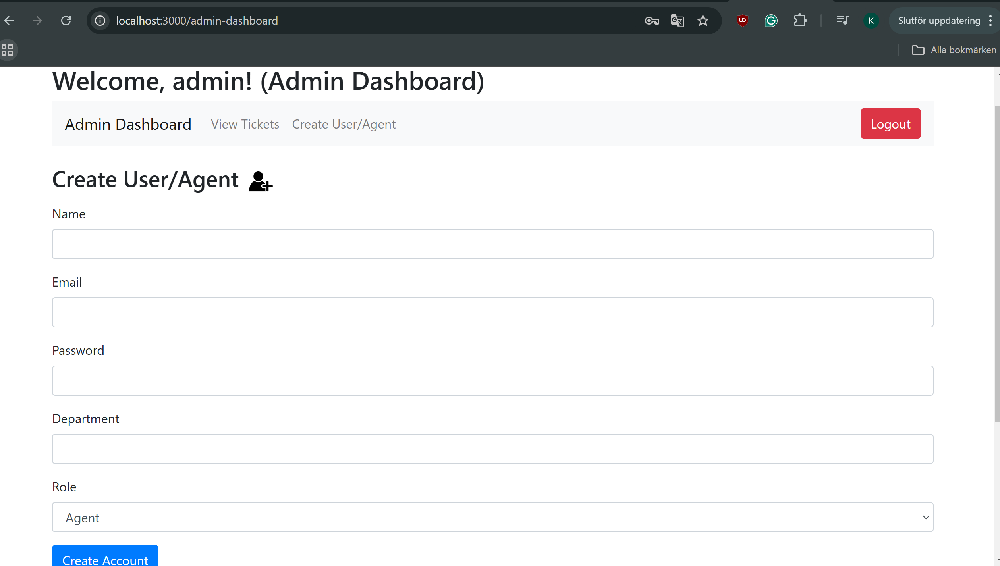
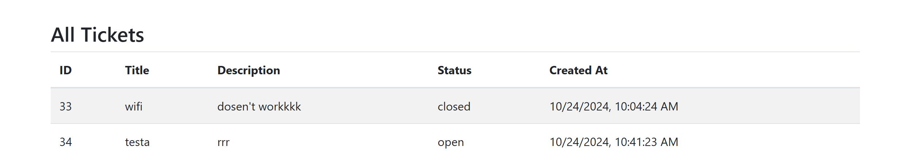
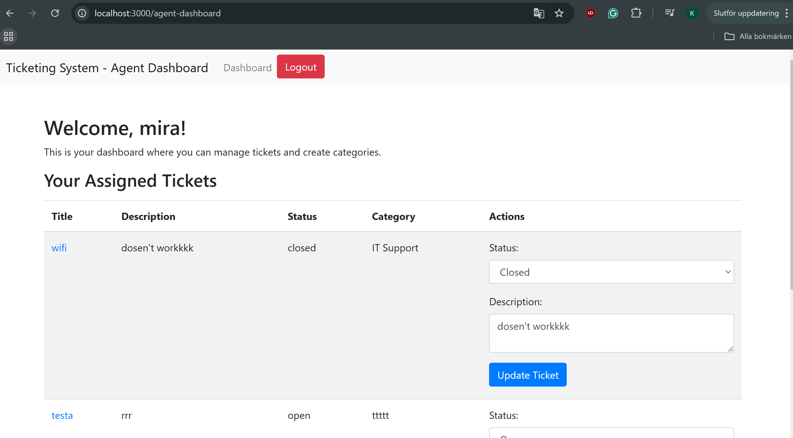
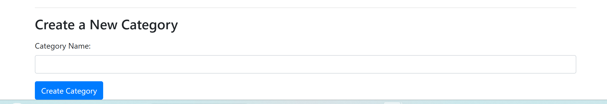
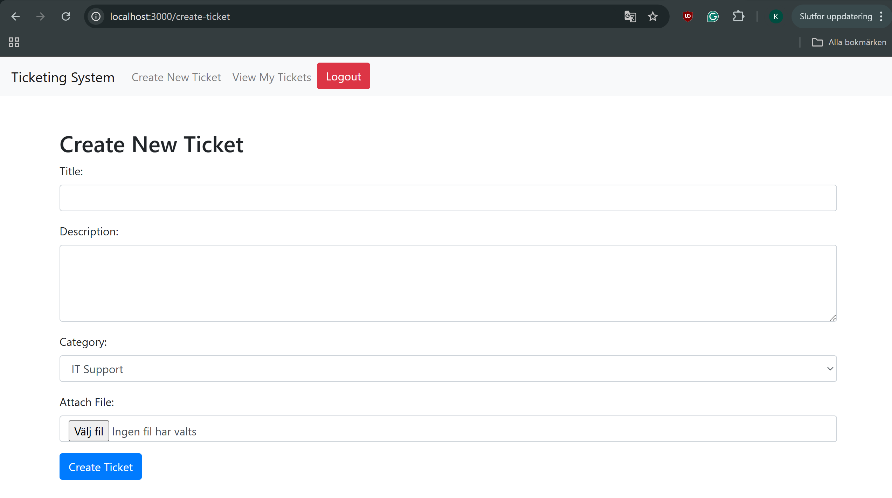
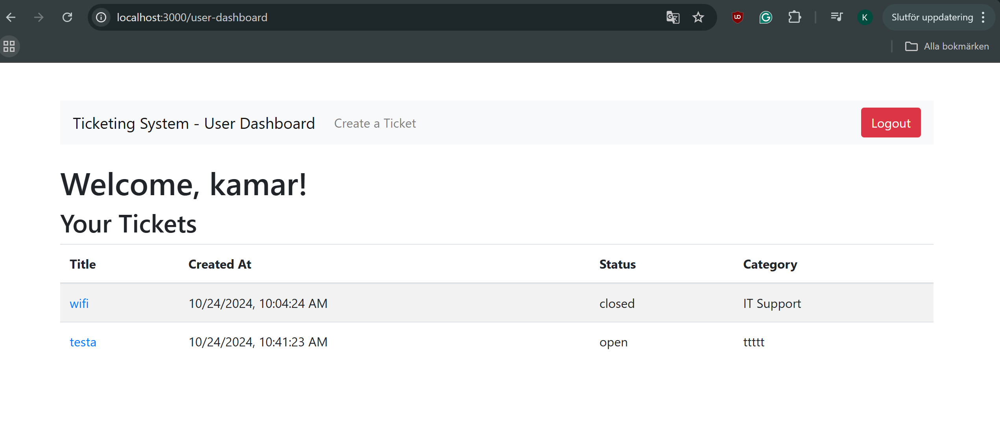
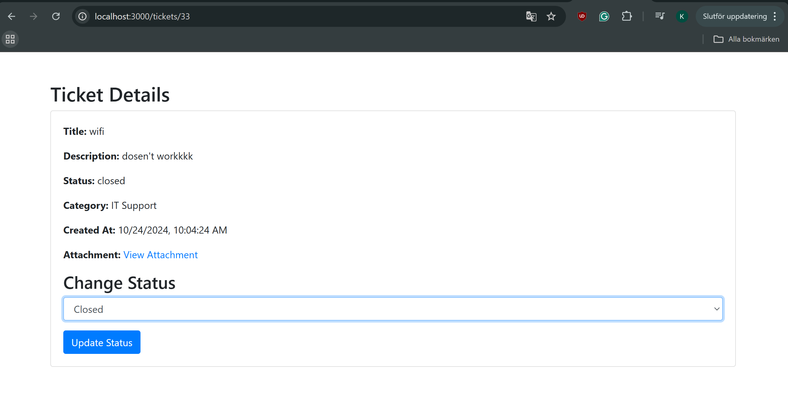
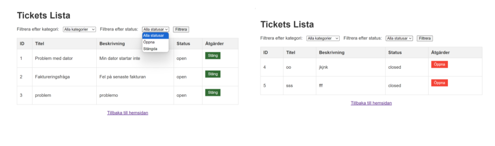

# Ticketing System

## Introduction

The Ticketing System is a web-based tool designed to simplify and organize customer support ticket management. This project focuses on efficient issue tracking and resolution, with an emphasis on security, a user-friendly experience, and effective communication between agents and users.

Users can create tickets, attach documents if needed, and track their progress until resolved. Agents can view, categorize, and manage tickets while staying in touch with users to keep them informed. Role-based access ensures only specific roles—like admins, agents, and users—can access certain features based on their permissions.

---

## Features

1. **Create Tickets**
   - Users can create tickets by entering a description of their issue and other relevant details.

2. **Attach Documents and Images**
   - Users can attach documents and images to tickets. The system uses Multer to handle file uploads securely.

3. **Categorize Tickets**
   - Users and agents can specify a category for each ticket to ensure it's handled by the appropriate team.

4. **Ticket Sorting and Filtering**
   - The system provides a list of created tickets, allowing users and agents to sort and filter them based on description, category, agent, and status.

5. **Category Creation**
   - Agents have the ability to create and manage categories to keep ticket organization flexible and adaptable.

6. **Ticket Status Update**
   - Users and agents can update the status of tickets (open/closed) to reflect the current state of an issue.

7. **Single Sign-On (SSO)**
   - The system supports Google OAuth via Passport.js for secure SSO functionality.

8. **Ticket Classification**
   - Tickets are automatically classified and routed to the appropriate team based on ticket content.

9. **Agent Management**
   - Only the super admin can create or invite new agents, maintaining strict control over user roles.
---

## Interface Screenshots

In the following steps, you can see what the first page looks like and log in.

---


When you log in as admin so you get to the page there you must create an account: agent or user



On the admin page, you can also view all created tickets.



As an agent, you can add a new category, change the status, or update the description.






As a user, you can create a ticket by providing a title, describing the issue, and uploading files. You can also select the appropriate category for the ticket.




In the table, click on the title to view more details of the ticket.




OBS! I previously worked on this and demonstrated in the first demo that you can sort by category and status to show which tickets are open and which are closed.



---

## How to Use

### Prerequisites

Before building and running the project, make sure you have the following installed:

- **Node.js** (version X.X.X or later)
- **MySQL** (version X.X.X or later)
- **npm** (included with Node.js)
- **Passport.js** for authentication

Install dependencies by navigating to the project directory and running:
```bash```
npm install

---

### You also need a .env file in the root directory with the following information:
```
DB_HOST=your_database_host
DB_USER=your_database_user
DB_PASSWORD=your_database_password
DB_NAME=your_database_name
GOOGLE_CLIENT_ID=your_google_client_id
GOOGLE_CLIENT_SECRET=your_google_client_secret
SESSION_SECRET=your_session_secret
```

## Build
### How to Set Up the Project
Download the Project Start by copying the project to your computer:

```
bash
git clone https://github.com/kamhaal/ticketing-system
cd ticketing-system
```

### DATABASE
Prepare the Database Use MariaDB to set up the database. The necessary SQL scripts are in the sql folder. Run the reset script to create the tables and procedures:
```
mariadb -u <your_username> -p
source sql/reset.sql;
```

### Run
To start the project, run:
```
npm start
OR
node server.js
```

Client: Open your browser and navigate to http://localhost:3000
API Endpoints: For backend API testing, you can use tools like Postman or cURL.

Add Required Packages Since the node_modules folder isn’t included, you need to install all project dependencies yourself:

```
npm install
```

### License

This project is licensed under the MIT License - see the [LICENSE](LICENSE) file for details.
