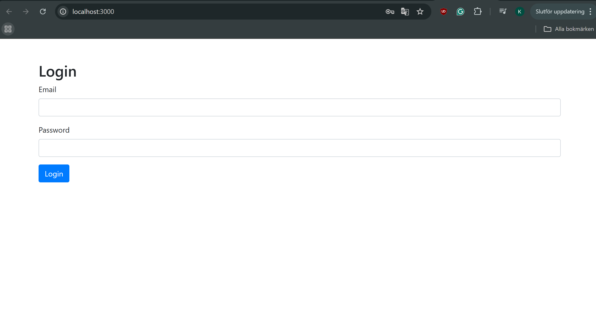

# Ticketing System

The Ticketing System is a web-based tool designed to simplify and organize customer support ticket management. This project focuses on efficient issue tracking and resolution, with an emphasis on security, a user-friendly experience, and effective communication between agents and users.

Users can create tickets, attach documents if needed, and track their progress until resolved. Agents can view, categorize, and manage tickets while staying in touch with users to keep them informed. Role-based access ensures only specific roles—like admins, agents, and users—can access certain features based on their permissions.

## Table of Contents
- [Features](#features)
- [Requirements](#requirements)
- [Installation](#installation)
- [Usage](#usage)
- [Non-Functional Requirements](#non-functional-requirements)
- [Contributing](#contributing)
- [License](#license)

---

## Features

1. **Create Tickets**
   - Users can create tickets by entering a description of their issue and other relevant details.

2. **Attach Documents and Images**
   - Users can attach documents and images to tickets. The system uses Multer to handle file uploads securely.

3. **Categorize Tickets**
   - Users and agents can specify a category for each ticket to ensure it's handled by the appropriate team.

4. **Ticket Sorting and Filtering**
   - The system provides a list of created tickets, allowing users and agents to sort and filter them based on description, category, agent, and status.

5. **Category Creation**
   - Agents have the ability to create and manage categories to keep ticket organization flexible and adaptable.

6. **Ticket Status Update**
   - Users and agents can update the status of tickets (open/closed) to reflect the current state of an issue.

7. **Single Sign-On (SSO)**
   - The system supports Google OAuth via Passport.js for secure SSO functionality.

8. **Ticket Classification**
   - Tickets are automatically classified and routed to the appropriate team based on ticket content.

9. **Agent Management**
   - Only the super admin can create or invite new agents, maintaining strict control over user roles.

In the following steps, you can see what the first page looks like and log in.

---

## Requirements

- **Node.js** and **Express**: Backend server framework
- **MySQL**: Database to store ticket and user information
- **Passport.js**: User authentication with Google OAuth
- **Multer**: File upload handling
- **Frontend**: Basic web interface for ticket interaction (React or a templating engine can be used here)

## Installation
# ticketing-system
